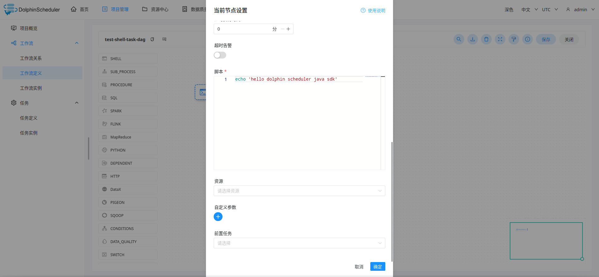
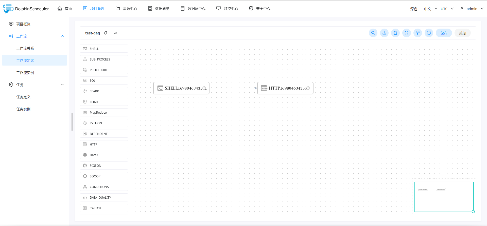
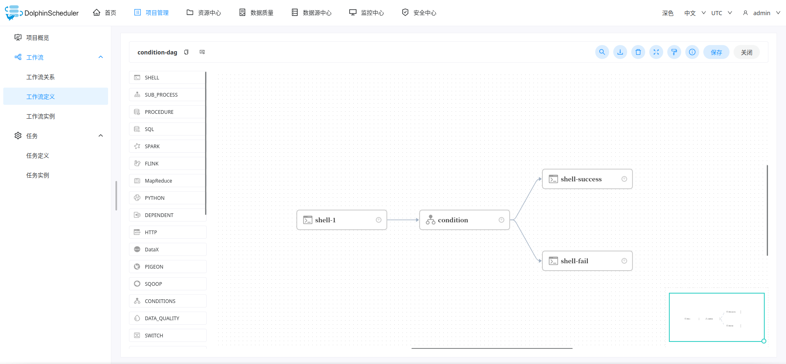

# 1 背景

在我们的场景中，dolphin scheduler已经成为我们作业的底层系统，几乎所有需要调度的任务都跑在dolphin scheduler上。

此外会有很多的第三方系统去对接dolphin scheduler，但是dolphin官方没有java sdk，如果用swagger去生成会非常难用，所以我们很需要一个公共的sdk供三方系统进行使用。因为通过代码去进行dolphin scheduler的工作流构建还是相对比较麻烦的事情，用户需要关心的参数比较多，上手比较困难。


# 2 功能特点

## 2.1 方便使用

本sdk尽可能的简化工作流的创建，让用户尽量少的去填写参数。同时尽可能多的构建实体类而不是Map,让用户知道自己设置的参数是什么东西。

你可以像使用页面那样的流程去操作定义dolphin scheduler上的资源，不过不同的是，你是通过代码的方式去实现。

## 2.2 多版本支持

随着dolphin scheduler的不断发展，rest api很可能会发生变化，所以我目前支持了dolphin scheduler`2.0.5`,`3.1.4`,`3.2.0`版本。如果你使用的是其他版本，可以考虑自行做修改，一般来说改动量不大

* `2.0.5-release` in branch `2.0.5-release`
* `3.1.4-release` in branch `3.1.4-release`
* `3.2.0-release` in branch `3.2.0-release`

## 2.3 支持的操作

| 内容       | 支持的操作                                                   |
| ---------- | ------------------------------------------------------------ |
| 项目       | 创建项目，更新项目，列出项目，删除项目                       |
| 工作流     | 创建工作流定义，更新工作流定义，删除工作流定义，上线/下线工作流定义 |
| 工作流实例 | 运行工作流实例，重跑工作流实例，删除工作流实例，列出工作流实例，停止工作流实例，暂停工作流实例 |
| 定时       | 创建定时，更新定时，上线定时，下线定时，删除定时，查询定时   |
| 数据源     | 创建数据源，更新数据源，列出数据源，删除数据源               |
| 资源       | 在线创建文件，在线更新文件内容，列出文件，删除文件           |
| 告警       | 创建告警插件，列出告警插件                                   |
| 租户       | 创建租户，更新租户，删除租户，列出租户                       |

# 3 使用指南

## 3.1 编译安装

```shell
git clone https://github.com/weaksloth/dolphinscheduler-sdk-java.git
mvn install -Dmaven.test.skip=true 
```


## 3.2 导入依赖

在你的程序中，引入 `dolphinscheduler-sdk-java` 依赖

```xml
<dependency>
    <groupId>com.github.weaksloth</groupId>
    <artifactId>dolphinscheduler-sdk-java</artifactId>
    <version>x.x.x-RELEASE</version>
</dependency>
```


## 3.3 创建dolphin client

在使用dolphin client之前，请先准备好这些参数

| parameters     | comment                                                      |
| -------------- | ------------------------------------------------------------ |
| token          | dolphin scheduler token, 可以在web ui创建                    |
| dolphinAddress | dolphin scheduler入口,例如:`http://localhost:12345/dolphinscheduler` |


`springboot` project:

```java
@Configuration
public class BeanConfig {
    @Bean
    public DolphinClient dolphinClient() {
        String token = "xxxx";	// dolphin scheduler token
        String dolphinAddress = "http://localhost:12345/dolphinscheduler";  // dolphin scheduler address
        DolphinsRestTemplate restTemplate =
              new DolphinsRestTemplate(
                  new DefaultHttpClientRequest(
                      HttpClients.custom()
                          .addInterceptorLast(new RequestContent(true))
                          .setDefaultRequestConfig(RequestConfig.custom().build())
                          .build(),
                      RequestConfig.custom().build()));	
        
        return new DolphinClient(token,dolphinAddress,restTemplate);
    }
} 

// then you can use by  @Autowired private DolphinClient dolphinClient;
```


`java` project:

```java
String token = "xxxx";	// dolphin scheduler token
String dolphinAddress = "http://localhost:12345/dolphinscheduler";  // dolphin scheduler address
DolphinsRestTemplate restTemplate =
      new DolphinsRestTemplate(
          new DefaultHttpClientRequest(
              HttpClients.custom()
                  .addInterceptorLast(new RequestContent(true))
                  .setDefaultRequestConfig(RequestConfig.custom().build())
                  .build(),
              RequestConfig.custom().build()));	

DolphinClient dolphinClient = new DolphinClient(token,dolphinAddress,restTemplate);
```


## 3.4 操作dolphin scheduler

> 在test目录里有很多的测试代码可以提供参考

### 3.4.1 创建单节点任务作为工作流



通过下面的代码就可以创建一个类似上图的工作流任务，了解详细代码请参考：`com.github.weaksloth.dolphins.task.TaskTest`

```java
  @Test
  public void testShellTask() {
    Long taskCode = getClient().opsForProcess().generateTaskCode(projectCode, 1).get(0);
    ShellTask shellTask = new ShellTask();
    shellTask.setRawScript("echo 'hello dolphin scheduler java sdk'");

    // use utils to create task definition with default config
    TaskDefinition taskDefinition =
        TaskDefinitionUtils.createDefaultTaskDefinition(taskCode, shellTask);

    submit(taskCode, taskDefinition, "test-shell-task-dag", "test-shell-task");
  }


  private void submit(
      Long taskCode, TaskDefinition taskDefinition, String processName, String description) {
    ProcessDefineParam pcr = new ProcessDefineParam();
    pcr.setName(processName)
        .setLocations(TaskLocationUtils.verticalLocation(taskCode))
        .setDescription(description)
        .setTenantCode(tenantCode)
        .setTimeout("0")
        .setExecutionType(ProcessDefineParam.EXECUTION_TYPE_PARALLEL)
        .setTaskDefinitionJson(Collections.singletonList(taskDefinition))
        .setTaskRelationJson(TaskRelationUtils.oneLineRelation(taskCode))
        .setGlobalParams(null);

    ProcessDefineResp resp = getClient().opsForProcess().create(projectCode, pcr);
    System.out.println(resp);
    Assert.assertEquals(processName, resp.getName());
  }
```

上述代码会创建一个名为`test-shell-task-dag`的工作流任务，其中包含工作流节点`SHELL1698045817487`；工作流的任务节点名称可以自行修改(通过调用`TaskDefinitionUtils`)

### 3.4.2 创建多节点工作流

接下来我们创建一个简单的含有多个节点的工作流，其中包括两个节点：shell节点和http节点，http节点依赖shell节点



通过下面的代码我们就可以创建一个类似上图中展示的简单的工作流任务，详细代码请参考：`com.github.weaksloth.dolphins.workflow.WorkflowTest`

下面代码主要分为以下几步：

1. 获取任务code，通常来说你有几个任务就生成几个任务code
2. 创建任务->创建任务定义
3. 创建任务之间的关系，下面的代码利用`TaskRelationUtils`工具类将他们连接起来
4. 构建工作流定义参数

```java
  public static final String WORKFLOW_NAME = "test-dag";

  /**
   * create simple workflow like: shellTask -> httpTask
   *
   * <p>1.generate task code
   *
   * <p>2.create tasks
   *
   * <p>3.create task definitions
   *
   * <p>4.create task relations
   *
   * <p>5.create process create parm
   *
   * <p>
   */
  @Test
  public void testCreateProcessDefinition() {

    List<Long> taskCodes = getClient().opsForProcess().generateTaskCode(projectCode, 2);

    // build shell task
    ShellTask shellTask = new ShellTask();
    shellTask.setRawScript("echo 'hello dolphin scheduler java sdk'");
    TaskDefinition shellTaskDefinition =
        TaskDefinitionUtils.createDefaultTaskDefinition(taskCodes.get(0), shellTask);

    // build http task
    HttpTask httpTask = new HttpTask();
    httpTask
        .setUrl("http://www.baidu.com")
        .setHttpMethod("GET")
        .setHttpCheckCondition("STATUS_CODE_DEFAULT")
        .setCondition("")
        .setConditionResult(TaskUtils.createEmptyConditionResult());
    TaskDefinition httpTaskDefinition =
        TaskDefinitionUtils.createDefaultTaskDefinition(taskCodes.get(1), httpTask);

    ProcessDefineParam pcr = new ProcessDefineParam();
    pcr.setName(WORKFLOW_NAME)
        .setLocations(TaskLocationUtils.horizontalLocation(taskCodes.toArray(new Long[0])))
        .setDescription("test-dag-description")
        .setTenantCode(tenantCode)
        .setTimeout("0")
        .setExecutionType(ProcessDefineParam.EXECUTION_TYPE_PARALLEL)
        .setTaskDefinitionJson(Arrays.asList(shellTaskDefinition, httpTaskDefinition))
        .setTaskRelationJson(TaskRelationUtils.oneLineRelation(taskCodes.toArray(new Long[0])))
        .setGlobalParams(null);

    System.out.println(getClient().opsForProcess().create(projectCode, pcr));
  }
```


### 3.4.3 使用condition节点

下面我们使用condition节点来实现下面一个逻辑：如果`shell-1`任务运行成功，则调用`shell—success`任务打印"success"，如果运行失败，则调用`shell-fail`任务打印"fail"，此代码可能比较繁琐，但是只要按照步骤一步步操作相信掌握工作流的创建也不会很难。




通过下面的代码我们可以构建上述图片中的dag，其中`TaskLocation`就相当于我们在画布上去设置任务的坐标，`TaskReation`就是节点与节点之间的关系抽象。

```java
  @Test
  public void testConditionTask() {
    List<Long> taskCodes = getClient().opsForProcess().generateTaskCode(projectCode, 4);

    // -------------building task------------------
    // shell task
    Long shellTaskCode = taskCodes.get(0);
    ShellTask shellTask = new ShellTask();
    shellTask.setRawScript("echo 'hello dolphin scheduler java sdk'");
    TaskDefinition shellTaskDefinition =
        TaskDefinitionUtils.createDefaultTaskDefinition("shell-1", shellTaskCode, shellTask);

    // success task
    Long successTaskCode = taskCodes.get(1);
    ShellTask successTask = new ShellTask();
    successTask.setRawScript("echo 'success'");
    TaskDefinition successTaskDefinition =
        TaskDefinitionUtils.createDefaultTaskDefinition(
            "shell-success", successTaskCode, successTask);

    // fail task
    Long failTaskCode = taskCodes.get(2);
    ShellTask failTask = new ShellTask();
    failTask.setRawScript("echo 'fail'");
    TaskDefinition failTaskDefinition =
        TaskDefinitionUtils.createDefaultTaskDefinition("shell-fail", failTaskCode, failTask);

    // condition task
    Long conditionTaskCode = taskCodes.get(3);
    ConditionTask conditionTask =
        TaskUtils.buildConditionTask(
            successTaskDefinition.getCode(),
            failTaskDefinition.getCode(),
            Collections.singletonList(shellTaskDefinition.getCode()));
    TaskDefinition conditionTaskDefinition =
        TaskDefinitionUtils.createDefaultTaskDefinition(
            "condition", conditionTaskCode, conditionTask);
    // ----------------end of building task--------------------


    // -----------building relation---------------
    TaskRelation r1 = new TaskRelation().setPostTaskCode(shellTaskCode);
    TaskRelation r2 = new TaskRelation().setPreTaskCode(shellTaskCode).setPostTaskCode(conditionTaskCode);
    TaskRelation r3 = new TaskRelation().setPreTaskCode(conditionTaskCode).setPostTaskCode(successTaskCode);
    TaskRelation r4 = new TaskRelation().setPreTaskCode(conditionTaskCode).setPostTaskCode(failTaskCode);
    // ------------end of building relation----------


    // set locations
    TaskLocation tl1 = new TaskLocation(shellTaskCode, 200, 340);
    TaskLocation tl2 = new TaskLocation(conditionTaskCode, 500, 340);
    TaskLocation tl3 = new TaskLocation(successTaskCode, 800, 240);
    TaskLocation tl4 = new TaskLocation(failTaskCode, 800, 440);  


    ProcessDefineParam pcr = new ProcessDefineParam();
    pcr.setName("condition-dag")
            .setLocations(Arrays.asList(tl1, tl2, tl3, tl4))
            .setDescription("test for use condition dag")
            .setTenantCode(tenantCode)
            .setTimeout("0")
            .setExecutionType(ProcessDefineParam.EXECUTION_TYPE_PARALLEL)
            .setTaskDefinitionJson(Arrays.asList(shellTaskDefinition, successTaskDefinition, failTaskDefinition, conditionTaskDefinition))
            .setTaskRelationJson(Arrays.asList(r1,r2,r3,r4))
            .setGlobalParams(null);

    ProcessDefineResp resp = getClient().opsForProcess().create(projectCode, pcr);
    System.out.println(resp);
    Assert.assertEquals("condition-dag", resp.getName());

  }
```

