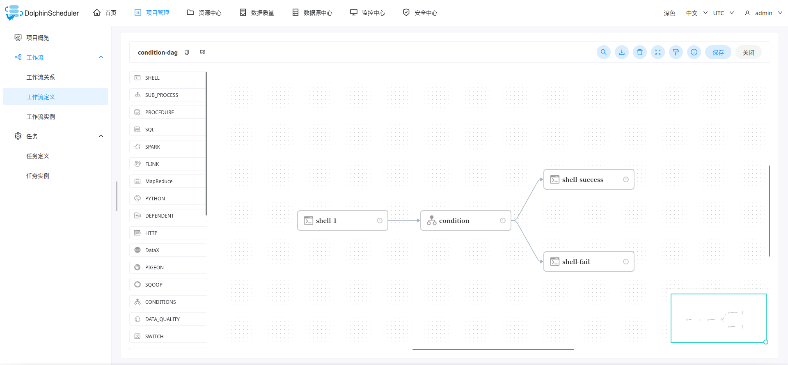

# dolphinscheduler-sdk-java

the java sdk for operating dolphinscheduler,which supports multi versions

# 1 Why do this?
In our company,dolphin scheduler becomes base system for our job.Then we want to operate dolphin scheduler by RPC instead of the web view.
however,dolphin scheduler has not support java sdk yet,only python sdk.so I do this


# 2 Features
##  2.1 easy to operate
just use this sdk like using web ui


## 2.2 support multiple versions

with dolphinscheduler's develop,the rest api maybe change,so there are two versions supported:

* `2.0.5-release` in branch `2.0.5-release`
* `3.1.4-release` in branch `3.1.4-release`
* `3.2.0-release` in branch `3.2.0-release`

## 2.3 support multiple operations

Project:

* create project
* update project
* list project
* delete project


Process Definition：

* create process definition

* update process definition

* delete process definition

* release(online/offline) process definition

  

Process Instance

* start process instance
* rerun process instance
* delete process instance
* list process instance
* stop process instance
* pause process instance


Schedule

* create schedule
* update schedule
* online schedule
* offline schedule
* delete schedule
* get schedule by workflow code


DataSource

* create datasource
* update datasource
* list datasource
* delete datasource


Resource

* online create file
* update file content
* page file
* delete file


Alert

* create alert plugin
* list alert plugin


Tenant:

* create tenant
* update tenant
* delete tenant
* list tenant


# 3 Getting Started

## 3.1 install

```shell
git clone https://github.com/weaksloth/dolphinscheduler-sdk-java.git
mvn install -Dmaven.test.skip=true 
```


## 3.2 maven import

in your project,import `dolphinscheduler-sdk-java`

```xml
<dependency>
    <groupId>com.github.weaksloth</groupId>
    <artifactId>dolphinscheduler-sdk-java</artifactId>
    <version>x.x.x-RELEASE</version>
</dependency>
```


## 3.3 create dolphin client

necessary parameters from dolphin scheduler:

| parameters     | comment                                                      |
| -------------- | ------------------------------------------------------------ |
| token          | dolphin scheduler token, created by web ui                   |
| dolphinAddress | dolphin scheduler endpoint, for example:`http://localhost:12345/dolphinscheduler` |


`springboot` project:

```java
@Configuration
public class BeanConfig {
    @Bean
    public DolphinClient dolphinClient() {
        String token = "xxxx";	// dolphin scheduler token
        String dolphinAddress = "http://localhost:12345/dolphinscheduler";  // dolphin scheduler address
        DolphinsRestTemplate restTemplate =
              new DolphinsRestTemplate(
                  new DefaultHttpClientRequest(
                      HttpClients.custom()
                          .addInterceptorLast(new RequestContent(true))
                          .setDefaultRequestConfig(RequestConfig.custom().build())
                          .build(),
                      RequestConfig.custom().build()));	
        
        return new DolphinClient(token,dolphinAddress,restTemplate);
    }
} 

// then you can use by  @Autowired private DolphinClient dolphinClient;
```


`java` project:

```java
String token = "xxxx";	// dolphin scheduler token
String dolphinAddress = "http://localhost:12345/dolphinscheduler";  // dolphin scheduler address
DolphinsRestTemplate restTemplate =
      new DolphinsRestTemplate(
          new DefaultHttpClientRequest(
              HttpClients.custom()
                  .addInterceptorLast(new RequestContent(true))
                  .setDefaultRequestConfig(RequestConfig.custom().build())
                  .build(),
              RequestConfig.custom().build()));	

DolphinClient dolphinClient = new DolphinClient(token,dolphinAddress,restTemplate);
```


## 3.4 examples

>  **There are many examples for operating dolphin scheduler in `test` directory!**

### 3.4.1 single node as a dag


The below code shows how to create a shell task as a workflow.For details, reference:`com.github.weaksloth.dolphins.task.TaskTest`

```java
  @Test
  public void testShellTask() {
    Long taskCode = getClient().opsForProcess().generateTaskCode(projectCode, 1).get(0);
    ShellTask shellTask = new ShellTask();
    shellTask.setRawScript("echo 'hello dolphin scheduler java sdk'");

    // use utils to create task definition with default config
    TaskDefinition taskDefinition =
        TaskDefinitionUtils.createDefaultTaskDefinition(taskCode, shellTask);

    submit(taskCode, taskDefinition, "test-shell-task-dag", "test-shell-task");
  }
```


### 3.4.2 simple dag


```java
  public static final String WORKFLOW_NAME = "test-dag";

  /**
   * create simple workflow like: shellTask -> httpTask
   *
   * <p>1.generate task code
   *
   * <p>2.create tasks
   *
   * <p>3.create task definitions
   *
   * <p>4.create task relations
   *
   * <p>5.create process create parm
   *
   * <p>
   */
  @Test
  public void testCreateProcessDefinition() {

    List<Long> taskCodes = getClient().opsForProcess().generateTaskCode(projectCode, 2);

    // build shell task
    ShellTask shellTask = new ShellTask();
    shellTask.setRawScript("echo 'hello dolphin scheduler java sdk'");
    TaskDefinition shellTaskDefinition =
        TaskDefinitionUtils.createDefaultTaskDefinition(taskCodes.get(0), shellTask);

    // build http task
    HttpTask httpTask = new HttpTask();
    httpTask
        .setUrl("http://www.baidu.com")
        .setHttpMethod("GET")
        .setHttpCheckCondition("STATUS_CODE_DEFAULT")
        .setCondition("")
        .setConditionResult(TaskUtils.createEmptyConditionResult());
    TaskDefinition httpTaskDefinition =
        TaskDefinitionUtils.createDefaultTaskDefinition(taskCodes.get(1), httpTask);

    ProcessDefineParam pcr = new ProcessDefineParam();
    pcr.setName(WORKFLOW_NAME)
        .setLocations(TaskLocationUtils.horizontalLocation(taskCodes.toArray(new Long[0])))
        .setDescription("test-dag-description")
        .setTenantCode(tenantCode)
        .setTimeout("0")
        .setExecutionType(ProcessDefineParam.EXECUTION_TYPE_PARALLEL)
        .setTaskDefinitionJson(Arrays.asList(shellTaskDefinition, httpTaskDefinition))
        .setTaskRelationJson(TaskRelationUtils.oneLineRelation(taskCodes.toArray(new Long[0])))
        .setGlobalParams(null);

    System.out.println(getClient().opsForProcess().create(projectCode, pcr));
  }
```


### 3.4.3 condition dag



```java
  @Test
  public void testConditionTask() {
    List<Long> taskCodes = getClient().opsForProcess().generateTaskCode(projectCode, 4);

    // -------------building task------------------
    // shell task
    Long shellTaskCode = taskCodes.get(0);
    ShellTask shellTask = new ShellTask();
    shellTask.setRawScript("echo 'hello dolphin scheduler java sdk'");
    TaskDefinition shellTaskDefinition =
        TaskDefinitionUtils.createDefaultTaskDefinition("shell-1", shellTaskCode, shellTask);

    // success task
    Long successTaskCode = taskCodes.get(1);
    ShellTask successTask = new ShellTask();
    successTask.setRawScript("echo 'success'");
    TaskDefinition successTaskDefinition =
        TaskDefinitionUtils.createDefaultTaskDefinition(
            "shell-success", successTaskCode, successTask);

    // fail task
    Long failTaskCode = taskCodes.get(2);
    ShellTask failTask = new ShellTask();
    failTask.setRawScript("echo 'fail'");
    TaskDefinition failTaskDefinition =
        TaskDefinitionUtils.createDefaultTaskDefinition("shell-fail", failTaskCode, failTask);

    // condition task
    Long conditionTaskCode = taskCodes.get(3);
    ConditionTask conditionTask =
        TaskUtils.buildConditionTask(
            successTaskDefinition.getCode(),
            failTaskDefinition.getCode(),
            Collections.singletonList(shellTaskDefinition.getCode()));
    TaskDefinition conditionTaskDefinition =
        TaskDefinitionUtils.createDefaultTaskDefinition(
            "condition", conditionTaskCode, conditionTask);
    // ----------------end of building task--------------------


    // -----------building relation---------------
    TaskRelation r1 = new TaskRelation().setPostTaskCode(shellTaskCode);
    TaskRelation r2 = new TaskRelation().setPreTaskCode(shellTaskCode).setPostTaskCode(conditionTaskCode);
    TaskRelation r3 = new TaskRelation().setPreTaskCode(conditionTaskCode).setPostTaskCode(successTaskCode);
    TaskRelation r4 = new TaskRelation().setPreTaskCode(conditionTaskCode).setPostTaskCode(failTaskCode);
    // ------------end of building relation----------


    // set locations
    TaskLocation tl1 = new TaskLocation(shellTaskCode, 200, 340);
    TaskLocation tl2 = new TaskLocation(conditionTaskCode, 500, 340);
    TaskLocation tl3 = new TaskLocation(successTaskCode, 800, 240);
    TaskLocation tl4 = new TaskLocation(failTaskCode, 800, 440);  


    ProcessDefineParam pcr = new ProcessDefineParam();
    pcr.setName("condition-dag")
            .setLocations(Arrays.asList(tl1, tl2, tl3, tl4))
            .setDescription("test for use condition dag")
            .setTenantCode(tenantCode)
            .setTimeout("0")
            .setExecutionType(ProcessDefineParam.EXECUTION_TYPE_PARALLEL)
            .setTaskDefinitionJson(Arrays.asList(shellTaskDefinition, successTaskDefinition, failTaskDefinition, conditionTaskDefinition))
            .setTaskRelationJson(Arrays.asList(r1,r2,r3,r4))
            .setGlobalParams(null);

    ProcessDefineResp resp = getClient().opsForProcess().create(projectCode, pcr);
    System.out.println(resp);
    Assert.assertEquals("condition-dag", resp.getName());

  }
```

